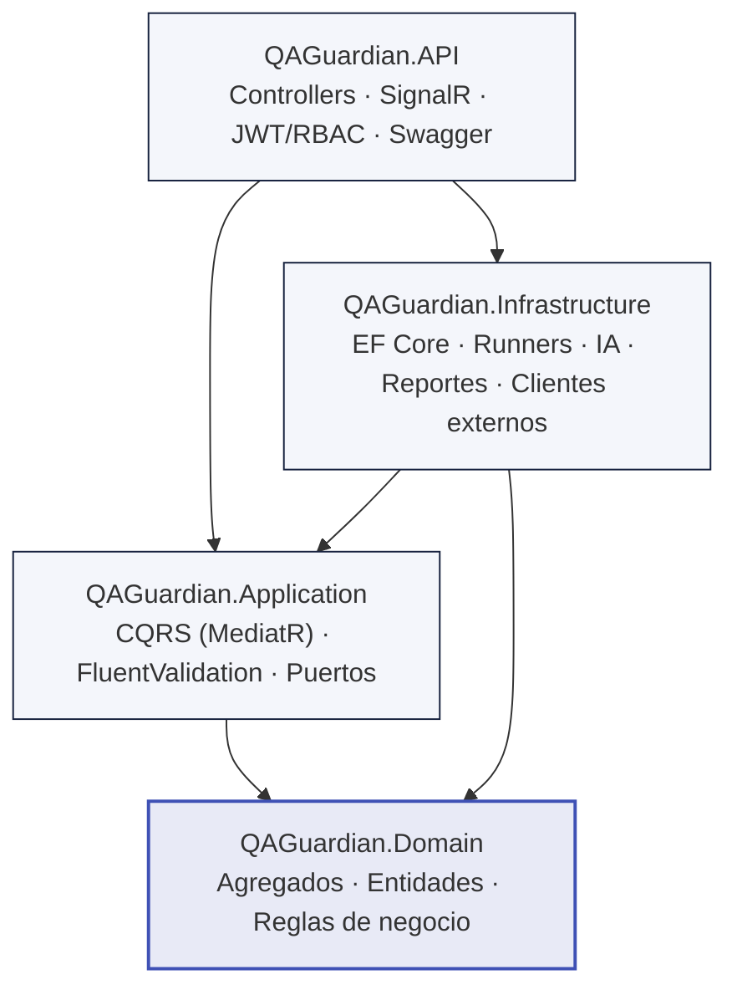
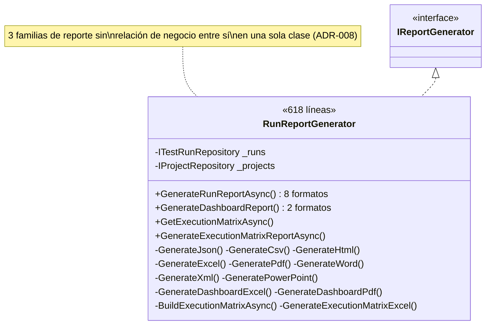
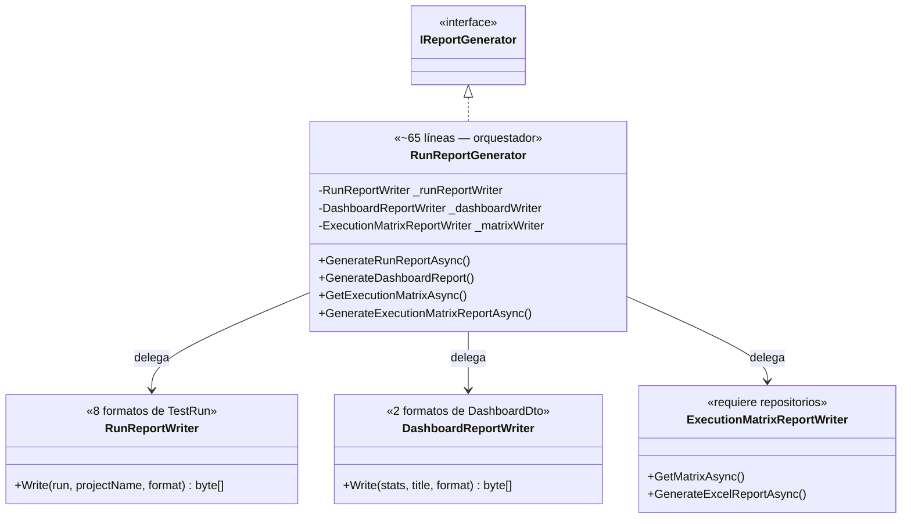
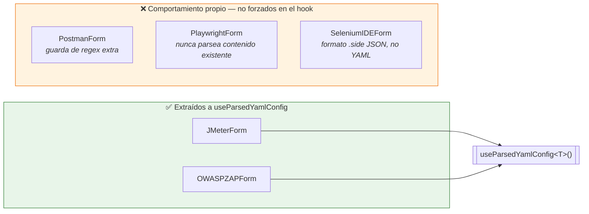

# Diagramas de arquitectura — Sprint 4

Diagramas Mermaid (se renderizan nativamente en GitHub/GitLab y en el visor de Markdown del
editor) que ilustran los refactors de este sprint. Ver `Technical-Debt-Audit.md` para el
detalle textual y los ADR-008/009/010 para la justificación de cada decisión.

---

## 1. Capas de Clean Architecture (verificado sin violaciones)



**Verificado por `grep`** (Sprint 4): `Domain` no importa `Application`/`Infrastructure`/`API`;
`Application` no importa `Infrastructure` directamente. Las flechas apuntan siempre hacia
adentro, como exige Clean Architecture — sin excepciones encontradas.

---

## 2. `RunReportGenerator` — antes (SRP violado)



## 2b. `RunReportGenerator` — después (Extract Class)



---

## 3. `TestRunnerFactory` — antes (OCP violado, Service Locator)

```mermaid
sequenceDiagram
    participant C as ExecuteTestRunCommandHandler
    participant F as TestRunnerFactory
    participant SP as IServiceProvider
    participant R as PlaywrightTestRunner

    C->>F: Resolve(AutomationFramework.Playwright)
    Note over F: switch (framework) { ... }
    F->>SP: GetRequiredService&lt;PlaywrightTestRunner&gt;()
    Note over SP: Service Locator: dependencia<br/>oculta, no visible en el constructor
    SP-->>F: instancia
    F-->>C: ITestRunner
    Note over F: Agregar un framework nuevo =<br/>editar este switch (viola OCP)
```

## 3b. `TestRunnerFactory` — después (búsqueda por diccionario inyectado)

```mermaid
sequenceDiagram
    participant DI as Contenedor DI
    participant F as TestRunnerFactory
    participant C as ExecuteTestRunCommandHandler

    DI->>F: new(IEnumerable&lt;ITestRunner&gt; runners)
    Note over F: _runnersByFramework =<br/>runners.ToDictionary(r => r.Framework)
    C->>F: Resolve(AutomationFramework.Playwright)
    Note over F: diccionario[framework] — sin switch
    F-->>C: ITestRunner
    Note over F: Agregar un framework nuevo =<br/>1 línea en DependencyInjection.cs,<br/>cero cambios aquí (cumple OCP)
```

---

## 4. Alcance real de la duplicación en formularios de automatización



**Lección del sprint**: el tamaño de archivo similar (429/398/267/245/230 líneas) y el
vocabulario compartido (`useEffect`, `updateConfig`, `defaultConfig`) sugerían 5 duplicados
idénticos. Leer las 5 implementaciones completas reveló que solo 2 lo son genuinamente — ver
ADR-010.
