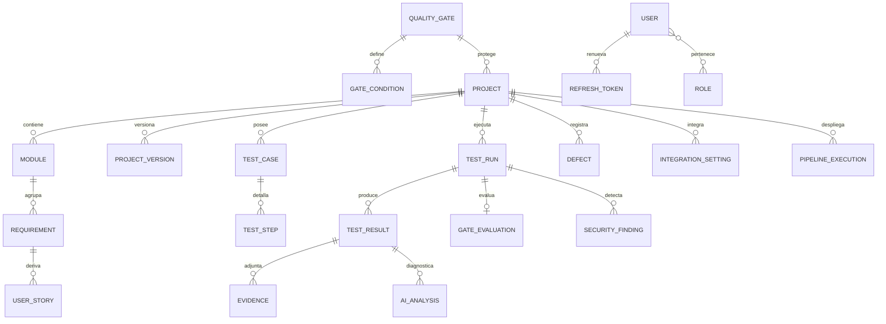

# Manual de Arquitectura — QA Guardian

## 1. Visión general

QA Guardian implementa **Clean Architecture / Hexagonal** con dependencias apuntando
hacia el dominio:

```
┌──────────────────────────────────────────────────────────────┐
│  API (adaptador primario)                                    │
│  Controllers · SignalR · JWT/RBAC · Rate limiting · Swagger  │
├──────────────────────────────────────────────────────────────┤
│  Application (casos de uso)                                  │
│  CQRS con MediatR · FluentValidation · Behaviors · Puertos   │
├──────────────────────────────────────────────────────────────┤
│  Domain (núcleo)                                             │
│  Agregados · Entidades · Enums · Reglas de negocio           │
├──────────────────────────────────────────────────────────────┤
│  Infrastructure (adaptadores secundarios)                    │
│  EF Core · Runners · SonarQube/GitHub · IA · SMTP/Webhooks   │
│  Hangfire · Redis · QuestPDF/ClosedXML/OpenXML               │
└──────────────────────────────────────────────────────────────┘
```

**Principios aplicados**: SOLID, DRY, KISS, YAGNI, Repository + Unit of Work,
inyección de dependencias en composición (`DependencyInjection.cs` por capa).

## 2. Flujo principal: ejecución con quality gate

```
POST /testruns ──▶ StartTestRunCommand ──▶ Hangfire (job en segundo plano)
                                              │
                     ExecuteTestRunCommand ◀──┘
                       1. TestRunnerFactory resuelve el motor por tipo:
                          Funcional/Regresión/Smoke/Visual → Playwright
                          API → Newman · Rendimiento → JMeter · Seguridad → ZAP
                       2. Persiste resultados + evidencias (screenshots, videos, logs)
                       3. Evalúa el Quality Gate del proyecto (aprueba/advierte/rechaza)
                       4. Notifica (correo/Teams/Slack/Discord/Telegram) según evento
                       5. Agente IA diagnostica cada fallo y registra defectos críticos
                       6. Publica check + comentario en el PR de GitHub (bloquea merge)
                       7. SignalR notifica el progreso al frontend en tiempo real
```

## 3. Agente inteligente de Pull Requests

`AnalyzePullRequestCommand` orquesta: archivos modificados del PR (API GitHub) →
generación de casos de prueba con IA (borradores `TC-AI-xxxx` para revisión de QA) →
ejecución de Smoke Tests con el SHA del PR → comentario resumen en el PR. El check de
GitHub resultante permite configurar *branch protection* para bloquear el merge.

## 4. Modelo Entidad-Relación



Detalles físicos (tipos, índices, constraints) en `database/01-schema.sql` y
`02-indexes-constraints.sql`. Todas las tablas de negocio usan Guid como PK,
auditoría (`CreatedAt/By`, `UpdatedAt/By`) y borrado lógico (`IsDeleted`).

## 5. Decisiones de arquitectura (ADR resumidas)

| # | Decisión | Justificación |
|---|---|---|
| 1 | CQRS con un solo modelo de persistencia | Complejidad justa: separa lectura/escritura sin duplicar el esquema |
| 2 | Runners como procesos externos (`npx`, `jmeter`, `docker`) | Aísla fallos, permite versionar herramientas sin recompilar |
| 3 | Hangfire para ejecución asíncrona | Reintentos, dashboard, colas persistentes en SQL Server |
| 4 | Evaluación del gate en el dominio (`QualityGate.Evaluate`) | La regla que aprueba despliegues es negocio puro y 100 % testeable |
| 5 | IA vía puerto `IAiAnalysisService` con fallback heurístico | La plataforma nunca depende de disponibilidad del LLM |
| 6 | SQLite + Hangfire en memoria en Development/Testing | Onboarding y CI sin infraestructura |
| 7 | Corrección global Modified→Added en `ChangeTracker.Tracked` | Entidades DDD generan su Guid en el constructor; evita `DbUpdateConcurrencyException` en hijos de agregados |
| 8 | [`RunReportGenerator` dividido por familia de reporte, no por formato](Architecture/adr/ADR-008-extract-report-writers.md) | Ejecución/dashboard/matriz no comparten lógica de negocio; dividir por formato habría sido una abstracción especulativa |
| 9 | [`TestRunnerFactory` resuelve por diccionario inyectado (`IEnumerable<ITestRunner>`)](Architecture/adr/ADR-009-testrunnerfactory-di-lookup.md) | Elimina el `switch` + Service Locator; agregar un runner nuevo no requiere tocar la fábrica (OCP) |
| 10 | [`useParsedYamlConfig` aplicado solo a 2 de 5 formularios de automatización](Architecture/adr/ADR-010-scoped-hook-extraction.md) | Los otros 3 tienen diferencias de comportamiento reales; forzarlos habría creado una abstracción más compleja que el duplicado que reemplaza |

Detalle completo de la auditoría de deuda técnica que originó las decisiones 8-10:
[Technical-Debt-Audit.md](Architecture/Technical-Debt-Audit.md).

## 6. Seguridad (OWASP Top 10 / ISO 27001)

| Control | Implementación |
|---|---|
| A01 Broken Access Control | RBAC con 8 roles y políticas por endpoint |
| A02 Cryptographic Failures | BCrypt (factor 12), AES-256 para tokens de integraciones, TLS en borde |
| A03 Injection | EF Core parametrizado; validación FluentValidation en el borde |
| A04 Insecure Design | Quality gates, revisión de PR, defensa en profundidad |
| A05 Security Misconfiguration | Cabeceras seguras, Swagger solo en desarrollo, errores sin detalles internos |
| A07 Auth Failures | Bloqueo tras 5 intentos, rotación de refresh tokens, JWT 30 min |
| A09 Logging Failures | Auditoría inmutable (ISO 27001 A.12.4) + Serilog estructurado |
| API4 Rate Limiting | Global 300 req/min por usuario/IP; 10 req/min en login |
| CSRF | API stateless con Bearer tokens (sin cookies de sesión) |
| CORS | Lista blanca de orígenes por ambiente |

## 7. Escalabilidad y extensión

- **Nuevo motor de pruebas**: implementar `ITestRunner`, registrarlo y mapearlo en
  `TestRunnerFactory` — sin tocar Application ni Domain.
- **Nuevo canal de notificación**: agregar el caso en `NotificationDispatcher`.
- **Nuevo formato de reporte**: extender `ReportFormat` y `RunReportGenerator`.
- **Almacenamiento de evidencias en la nube**: reemplazar `FileEvidenceStorage`
  por una implementación S3/Azure Blob del mismo puerto `IEvidenceStorage`.
- Escalado horizontal: API stateless (JWT), Hangfire distribuye jobs entre nodos,
  Redis comparte caché y actúa como **backplane SignalR** cuando
  `ConnectionStrings:Redis` está configurado (obligatorio con ≥2 réplicas para
  progreso de ejecuciones consistente).
